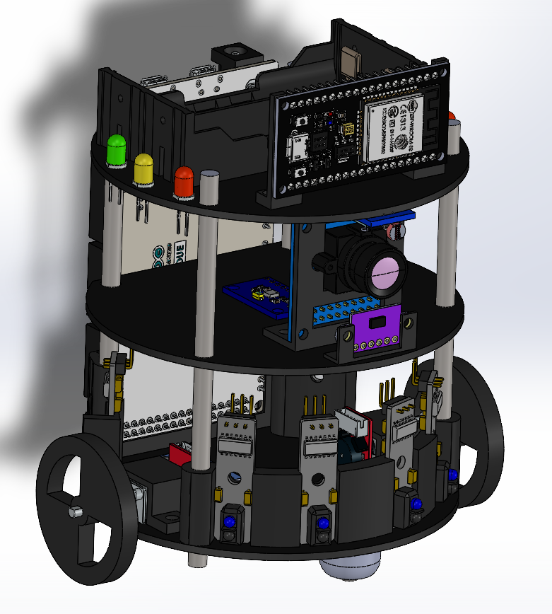

# 3D Parts

Welcome to the 3D Parts directory for our educational robot project! This directory contains various files related to the design, assembly, and 3D printing of the robot components.

## CAD Folder

The CAD (Computer-Aided Design) folder houses the detailed 3D models of individual robot parts. These files are created using CAD software (Solid Works 2022) and provide a comprehensive representation of each component. By accessing the CAD files, you can examine the dimensions, shapes, and other design aspects of the robot's parts. This folder is useful for understanding the robot's structure and can be used for further customization or modification.

## Assembly Folder

The Assembly folder contains higher-level representations of the robot, showcasing the integration and arrangement of various components. These files help in understanding how the individual parts come together to form the complete robot. Assembly files provide a more holistic view of the robot's construction, enabling users to visualize the relationships between different parts. It can be a valuable resource for assembling the robot accurately and efficiently.

## STL Files

The STL (Standard Tessellation Language) files are specifically prepared for 3D printing purposes. These files represent the robot components as a collection of triangles and provide a universal format compatible with most 3D printers. By accessing the STL files, you can easily 3D print the robot parts and assemble them physically. This folder contains ready-to-print files that allow you to bring the robot to life through additive manufacturing techniques.

We encourage you to explore the contents of each folder to gain a comprehensive understanding of the robot's design and assembly. Feel free to download the files you need and utilize them for educational purposes, such as learning about robotics, experimenting with different configurations, or even building your own version of the robot.

If you have any questions, suggestions, or would like to contribute to the project, please feel free to reach out. We value your interest and participation in this educational robot project!

Happy learning and building!
